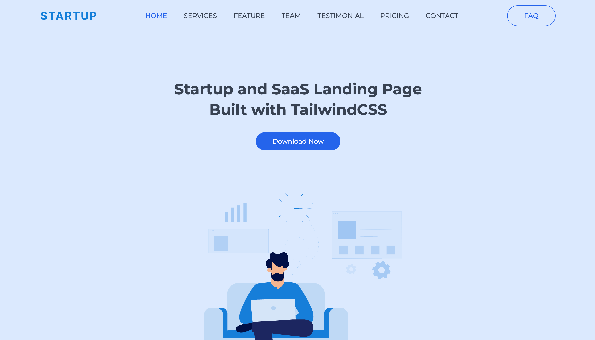

<h1>Startup Landing Page Template | <a href="">DEMO</a></h1>

This is a responsive landing page template designed for startups. The template is built using Tailwind CSS, HTML, and Pug, and compiled with Parcel.

<h2>Features</h2>

- Hero section
- Services section
- Features section
- Team section
- Clients section
- Testimonial section
- Pricing section
- Carousel section
- Email Subscribe section
- Contact Form section
- Map section
